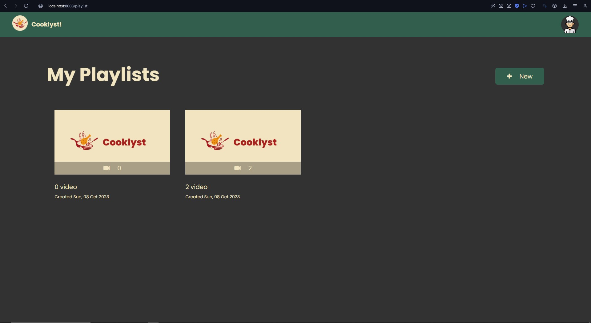

# Cooklyst - Who let them cook?
> Tugas Milestone 1 IF3110 Web-based Application Development - Monolithic PHP & Vanilla Web Application

## Deskripsi Aplikasi Web
Sebuah aplikasi berbasis web (hasil hibrida antara Cookp4d dan YouTub3) yang menyediakan video resep yang dapat ditonton penggunanya. 

## Daftar Requirement
### Umum
1. User dapat melakukan login.
2. User dapat menerima feedback sukses/gagal dari sebuah aksi.
3. User dapat melakukan logout.

### User Biasa
1. User dapat melakukan registrasi sebagai user biasa.
2. User dapat melihat dan mengubah profilnya.
3. User dapat menghapus akunnya.
4. User dapat melihat list video resep, melakukan searching, sorting, dan filtering pada list tersebut.
5. User dapat memilih dan melihat video resep yang ingin ditonton.
6. User dapat mempunyai beberapa playlist yang berisi video resep.
6. User dapat menambahkan dan menghapus video resep pada dalam playlist yang diinginkan.
7. User dapat melihat seluruh playlist yang dimilikinya.
8. User dapat menghapus playlist miliknya.
9. User dapat melihat seluruh video dalam playlist yang dipilih. 

### Admin
1. Tidak ada registrasi admin. Admin dibuat secara hardcode.
2. Admin dapat melihat dan mengubah profilnya.
3. Admin dapat menghapus akunnya.
4. Admin dapat melihat list video resep, melakukan searching, sorting, dan filtering pada list tersebut.
5. Admin dapat menambahkan video resep baru.
6. Admin dapat mengubah data suatu video resep.
7. Admin dapat menghapus resep.
8. Admin dapat memilih dan melihat video resep yang ingin ditonton.
9. Admin dapat mempunyai beberapa playlist yang berisi video resep.
10. Admin dapat menambahkan dan menghapus video resep pada dalam playlist yang diinginkan.
11. Admin dapat melihat seluruh playlist yang dimilikinya.
12. Admin dapat menghapus playlist miliknya.
13. Admin dapat melihat seluruh video dalam playlist yang dipilih.

## Cara Instalasi
1. [Install Docker](https://docs.docker.com/engine/install/)

## Cara Menjalankan
### Cara Menjalankan Server
1. Pastikan Docker Daemon sudah berjalan.
2. Build image Docker dengan memasukkan command `sh scripts/build-image.sh` pada terminal.
3. Jalankan container Docker dengan memasukkan command `docker compose up -d` pada terminal.
4. Lakukan seeding jika diperlukan dengan panduan [Cara Melakukan Seeding](#cara-melakukan-seeding).
5. Untuk mematikan container, masukkan command `docker compose down` pada terminal.

### Cara Melakukan Seeding
1. Gunakan terminal untuk container web pada Docker (dapat melalui Docker Desktop atau melalui command `docker exec`).
2. Masukkan command `php seed/seed.php` ke terminal.
3. Data akan ter-seed (baik database maupun static storage).

## Screenshot Tampilan Aplikasi
### Login Page  (/user/login)

### Register Page (/user/register)

### Exception Page
#### Unauthorized Page

#### Not Found Page

### Profile Page (/user)

### Home Page (/home)
#### Admin

#### User Biasa

### My Playlist Page (/playlist)

### My Playlist Page (/playlist/list/:id)

### Watch Recipe Page (/recipe/watch/:id)

### Add Recipe Page (/recipe/add)

### Edit Recipe Page (/recipe/edit/:id)

## Bonus: Google Lighthouse
### Login Page  (/user/login)

### Register Page (/user/register)

### Exception Page
#### Unauthorized Page

#### Not Found Page

### Profile Page (/user)

### Home Page (/home)
#### Admin

#### User Biasa

### My Playlist Page (/playlist)

### My Playlist Page (/playlist/list/:id)

### Watch Recipe Page (/recipe/watch/:id)

### Add Recipe Page (/recipe/add)

### Edit Recipe Page (/recipe/edit/:id)

## Pembagian Tugas
### Server Side
| Task                              | NIM                          |
| --------------------------------- | ---------------------------- |
| Core (Database, Storage, Routing) | 13521091, 13521121, 13521129 |
| User Model                        | 13521121                     |
| Recipe Model                      | 13521129                     |
| Playlist Model                    | 13521091                     |
| User Controller                   | 13521121                     |
| Recipe Controller                 | 13521129                     |
| Playlist Controller               | 13521091                     |

### Client Side
| Task                                   | NIM      |
| -------------------------------------- | -------- |
| Navigation Bar                         | 13521091 |
| Login Page (/user/login)               | 13521121 |
| Register Page (/user/register)         | 13521121 |
| Exception Page                         | 13521121 |
| Profile Page (/user)                   | 13521121 |
| Home Page (/home)                      | 13521091 |
| My Playlist Page (/playlist)           | 13521129 |
| Playlist Page (/playlist/list/:id)     | 13521091 |
| Watch Recipe Page (/recipe/watch/:id)  | 13521129 |
| Add Recipe Page (/recipe/add)          | 13521129 |
| Edit Recipe Page (/recipe/edit/:id)    | 13521129 |

*Page mencakup View, HTML, CSS, serta JS.
   
## Author
- 13521091 Fakih Anugerah Pratama
- 13521121 Saddam Annais Shaquille
- 13521129 Chiquita Ahsanunnisa
